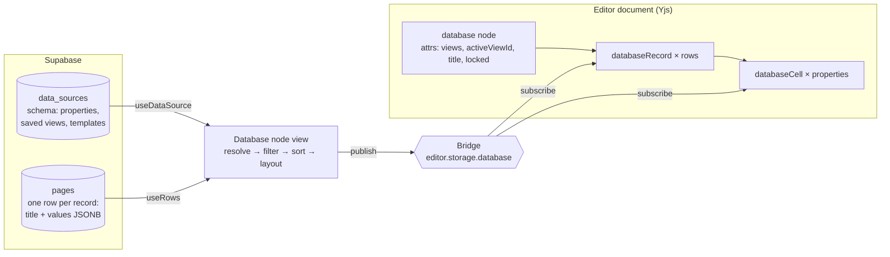
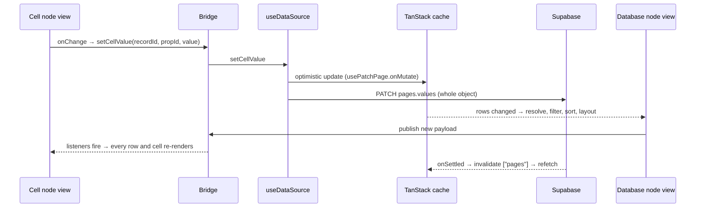

# How databases work

Databases are Folio's most important feature, and the most intricate part of the code. This page explains how they fit together so you can find your way around before changing anything. Paths are relative to the repository root; `db/` means `src/features/database/`.

If you only read one section, read [The bridge](#the-bridge).

## The big picture

A database has two halves that live in different places:

- **Supabase holds the data.** The schema is a row in `data_sources`; each row of the database is a row in `pages`.
- **The editor document holds the layout.** A `database` node in the page's TipTap/Yjs document stores the views (table, board…) and contains one `databaseRecord` node per row, each holding one `databaseCell` node per property.

The database node view loads the data with TanStack Query, computes everything (formulas, rollups, filters, sorts, layout), and publishes the result to the record and cell node views through **the bridge**.

## Where each piece of data lives

| Data | Stored in | Synced by |
| --- | --- | --- |
| Properties (schema) | `data_sources.properties` (JSONB array) | TanStack refetch |
| Cell values | `pages.values[propertyId]` on each row | TanStack refetch |
| Row title | `pages.title` | TanStack refetch |
| Created/edited time and by | Page columns (`created_at`, `updated_at`, `owner_id`, `edited_by`) | TanStack refetch |
| Formulas, rollups, two-way relation mirrors | **Not stored.** Recomputed on the client | — |
| Views, filters, sorts, groups, active view, title, lock | `database` node attributes | **Yjs** (live) |
| Which rows a node shows | `databaseRecord` child nodes | **Yjs** (live) |
| Saved views catalog (for "start from a view") | `data_sources.saved_views` | TanStack refetch |
| Row templates | `data_sources.row_templates` | TanStack refetch |

Types are in `src/types/types.ts`: `DataSource`, `PropertyType` (19 types), `PropertyConfig`, `DatabaseProperty`, `CellValueMap`, `DatabaseAttrs`, `BaseView` and the per-layout views (`TableView`, `BoardView`, `ListView`, `GalleryView`, `CalendarView`, `TimelineView`). Filters are in `src/types/filter-types.ts`.

### A row is a page

Every database row is an ordinary page with `source_id` set (`src/utils/make-row.ts`). Its `parent_id` is the database's own page, so sharing the database page shares its rows. Opening a row opens that page, with a property panel at the top (`db/record-property-panel/`).

### Inline, full-page and linked databases

- **Full-page:** `makeDatabasePage` (`src/utils/make-page.ts`) creates a page whose content is a title plus one `database` node. `data_sources.page_id` points at it.
- **Inline:** a `database` node inside any page. Creating one from the picker also creates the full page, so every database has at least two nodes.
- **Linked:** any number of `database` nodes, on any pages, can point at the same `sourceId` (`db/components/data-source-picker/`). They share the schema and rows; each node has its own views.

## The bridge

**The problem.** TipTap renders each node view (`ReactNodeViewRenderer`) as a separate React root. React context from the database node view can't reach the record and cell node views inside it.

**The solution.** A tiny pub/sub store on the editor: `editor.storage.database.entries`, a `Map` from database id to `{ data, listeners }` (`db/utils/database-bridge.ts`, storage created in `db/nodes/database-node/database-node.ts`).

- **Publisher (one per database node):** `DatabaseNodeViewBody` builds the payload in `db/hooks/use-database-bridge-publish.ts` and publishes it in a `useLayoutEffect` (`db/hooks/use-database-bridge-data.ts`).
- **Subscribers:** `DatabaseRecordNodeView` and `DatabaseCellNodeView` read it with `useSyncExternalStore` (`useDatabaseBridgeData`).
- **Payload** (`DatabaseBridgeData`): `properties`, the active `view`, `recordsById` (resolved rows), `sortedRecordIds` (the active view's row order), column widths, frozen-column offsets, `setCellValue`, and the board/gallery/calendar/timeline placement maps.

**Rows are positioned, not re-ordered.** Filtering and sorting never move nodes in the document. Each layout renders a grid around `<NodeViewContent>`; each record node view then styles its own ProseMirror box from the bridge data: `grid-row` from its index in `sortedRecordIds`, board column, gallery order, or timeline position. A row the view filters out gets `display: none` (`db/nodes/database-record-node-view/database-record-node-view.tsx`).

### What happens when you edit a cell

Files: `db/nodes/database-node/database-cell-node-view.tsx` → `db/hooks/use-data-source.ts` (`setCellValue`) → `src/hooks/use-patch-page.ts`.

### What happens when you add a row

1. `db/hooks/use-record-creation.ts` calls `addRecordAsync` → `makeRow` → `src/hooks/use-add-row.ts` (optimistic insert, then POST).
2. It inserts a `databaseRecord` node into the document (`insertRecordNode` in `db/hooks/use-database-seed.ts`).
3. Yjs carries the new node to collaborators. Until their pages cache has the row, the node finds no record and stays hidden.

### How other people's changes reach you

- **Views, filters, the row list:** live, through Yjs (node attributes and record nodes).
- **Cell values and the schema:** only when your client refetches (window focus, mount, or after your own edit). There is **no Supabase realtime subscription** for `pages` or `data_sources` yet. This is the cause of several bugs in the backlog.

## The pieces

| Piece | File | Job |
| --- | --- | --- |
| Node definitions | `db/nodes/database-node/database-node.ts` | `database`, `databaseRecord`, `databaseCell` nodes, commands, bridge storage |
| Database node view | `db/nodes/database-node/database-node-view.tsx` | Loads data, picks the layout, publishes the bridge |
| Data hook | `db/hooks/use-data-source.ts` | Source, rows, `setCellValue`, add/remove rows, templates, property writes, `resolvedRecords` |
| UI state and views | `db/hooks/use-database-ui.ts`, `use-database.ts` | Active view, view CRUD (node attributes), editing cell, panels |
| Properties | `db/hooks/use-database-properties.ts` | Add, delete, rename, reorder, freeze, hide |
| Context | `db/context/database-provider.tsx` | Sorted records, layouts, selection, new-row actions, drag handlers |
| Seeding | `db/hooks/use-database-seed.ts` | Creates record nodes once; keeps cells in step with properties |
| Filters / sorts / groups | `db/utils/apply-filters.ts`, `apply-sorts.ts`, `group-key.ts` | Pure functions (good first place for tests) |
| Layouts | `db/hooks/use-board-layout.ts`, `use-calendar-layout.ts`, `use-timeline-layout.ts`, `use-gallery-layout.ts` | Where each row goes in each view |
| Views | `db/nodes/database-*-node-view/` | Table, list, board, gallery, calendar, timeline |
| Cells | `db/components/cells/*`, `db/primitives/*` | Display and edit each property type |
| Drag and drop | `db/extensions/board-drag.ts` + `database-provider.tsx` | Board, gallery and calendar drops |

### Formulas, rollups and relations

All computed on the client, in this order (`use-data-source.ts`, `resolvedRecords`):

1. `resolveMirrorRelations` (`src/lib/relation-ids.ts`): the other side of two-way relations is derived, not stored.
2. `resolveRecordRollups` (`src/lib/compute-rollup.ts`).
3. `resolveRecordFormulas` (`src/lib/resolve-records-formula.ts`), using the evaluator in `db/components/formula-editor/formula-evaluator.ts` (built on mathjs; `prop("Name")` is resolved by property name).

### Permissions

Rows are pages, so the `pages` RLS policies apply, and access is inherited from the database page through `parent_id` (`page_effective_role`, migrations 022 and 039). `data_sources` is readable when its page is readable, writable through `can_write_data_source` (migration 021). The client doesn't check roles yet: cells are only read-only when the database is locked.

## Where to start

| Task | Files, in order |
| --- | --- |
| **Add a property type** | `src/types/types.ts` (`PropertyType`, `PropertyConfig`, `CellValueMap`) → `src/types/config.ts` and `src/types/property-type-meta.ts` → `src/types/filter-types.ts` (`OPERATORS_FOR_TYPE`) → `src/utils/initial-cell-value.ts`, `src/lib/convert-value.ts` → a new `db/components/cells/<type>-cell/` + `db/primitives/<type>-cell-display.tsx`, and a case in `db/components/cells/cell/cell.tsx` → config UI in `db/components/property-edit-popover/` → `db/utils/apply-filters.ts`, `apply-sorts.ts`, `group-key.ts`, `calc-utils.ts` → formulas (`cellToFormulaValue`) and rollups |
| **Add a view layout** | `ViewType` and a view interface in `src/types/types.ts` → `makeDefaultView` in `src/utils/make-default-view.ts` **and** `db/utils/index.ts` → `db/hooks/use-<layout>-layout.ts` → a placement field in `db/utils/database-bridge.ts` and `use-database-bridge-publish.ts` → `db/nodes/database-<layout>-node-view/` (render `<NodeViewContent>`) → the layout switch in `database-node-view.tsx` → a placement branch in `database-record-node-view.tsx` → toolbar (`view-palette.tsx`, `view-icon.tsx`, `layout-panel.tsx`) |
| **Add a filter operator** | `src/types/filter-types.ts` (operator, `OPERATORS_FOR_TYPE`, `OPERATOR_LABEL`, `NO_VALUE_OPERATORS`) → `matchesRule` in `db/utils/apply-filters.ts` → `db/components/filter-rule-chips/filter-value-input.tsx`, `operators-dropdown.tsx` |
| **Add a formula function** | `buildFunctionScope` in `formula-evaluator.ts` → `formula-help.ts` → `formula-completions.ts` → `formula-language.ts` |
| **Add a calculation** | `CalcType` in `src/types/types.ts` → `db/utils/calc-utils.ts` → `db/components/calc-menu-item/`, `database-calculations/` |
| **Fix a cell editor** | `db/components/cells/<type>-cell/` → `db/primitives/<type>-cell-display.tsx` → `db/primitives/cell-editor-popover.tsx`. Also check the row panel (`edit-property-list/`) and cards (`db/primitives/board-card-body.tsx`) |
| **Grouping** | `db/utils/group-key.ts`, `group-records.ts`, `group-rows.ts`; `db/components/group-panel/`, `group-headers/` |
| **Drag and drop** | `db/extensions/board-drag.ts`, `db/extensions/utils.ts`, `db/context/database-provider.tsx` |
| **Row templates** | `db/hooks/use-data-source.ts` (templates section), `src/utils/make-row.ts` |

## Rules and gotchas

- **Never update React state from an editor event listener** (`editor.on("transaction")` → setState loops). Read editor state with `useEditorState`, and database data through the bridge.
- **Don't move record nodes to sort or filter.** Change the bridge data; the record node view positions itself.
- **Writes replace whole JSON objects.** `setCellValue` sends the row's whole `values`, property changes send the whole `properties` array, view changes replace the node's whole `views` attribute. Be careful with anything that writes from a cached copy (see the backlog's sync issues before adding more).
- **Seeding and cell sync transactions use `addToHistory: false`.** Keep it that way, or undo will remove rows.
- **Several databases can share a page.** Never use `document.querySelector` or editor-wide storage for something that belongs to one database; key it by database id.
- **Dates:** a plain `yyyy-mm-dd` string parses as UTC midnight in JavaScript. Build local dates from parts when comparing days.
- **Every visible string goes through `t()`**, in `en` and `fr`. Run `node scripts/check-i18n.mjs`.

## Known issues

The database backlog lists the open bugs and planned features, each with the files involved. Look for issues labelled `database` on GitHub, and check there before starting something big.
